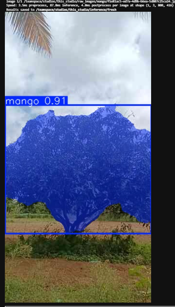
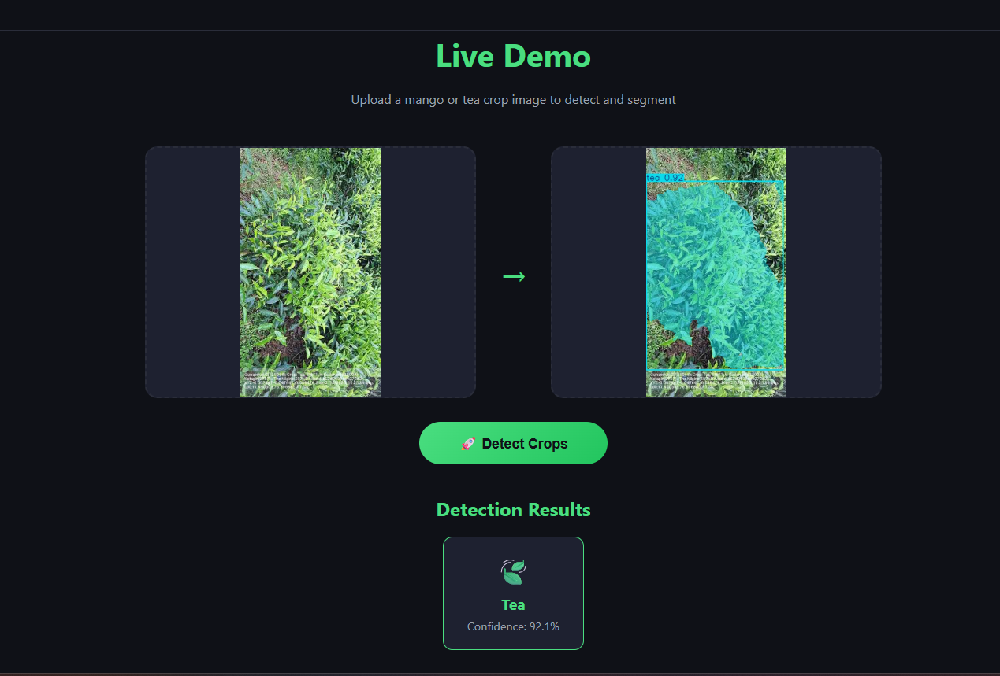

# 🌱 Crop Detection and Segmentation using YOLOv8

## 📌 Overview
This project focuses on automated detection and pixel-wise segmentation of mango and tea crops using deep learning techniques.

The project was carried out during my AI/ML internship at Tamil Nadu e-Governance Agency (TNeGA) and follows a two-phase approach to improve model performance through dataset expansion and optimization.

---

## 🎯 Problem Statement
Manual crop identification and monitoring is time-consuming and prone to errors.  
This project aims to automate crop detection and segmentation using deep learning to support agricultural analysis and decision-making.

---

## 🎯 Objectives
- Develop a deep learning-based crop detection system  
- Perform instance segmentation using YOLOv8  
- Train and compare YOLOv8 and RT-DETR models  
- Improve model performance using dataset expansion  
- Automate annotation using SAM2  
- Build a real-time prediction system  

---

## 🧠 Methodology

### 🔹 Phase 1: Baseline Training
- Dataset: 1,277 CVAT-annotated images  
- Models:
  - YOLOv8m-seg  
  - YOLOv8x-seg  
  - RT-DETR  
- Result:
  - Segmentation mAP50 ≈ 49.7%  

📌 Observation: Limited dataset size restricted model performance.

---

### 🔹 Phase 2: Dataset Expansion and Final Model
- Expanded dataset to 3,134 images using:
  - CVAT dataset  
  - Roboflow dataset  
- SAM2 used to convert bounding boxes into segmentation masks  

### Processing Steps:
- Dataset merging and class remapping  
- Train/Validation/Test split (70/15/15)  
- Data augmentation  
- Model fine-tuning  

---

## ⚙️ Tools and Technologies
- Python  
- PyTorch  
- YOLOv8 (Ultralytics)  
- RT-DETR  
- OpenCV  
- Flask (for deployment)  
- CVAT and Roboflow  

---

## 📊 Results

### ✅ Final Model: YOLOv8l-seg
- Segmentation mAP50 (Validation): **71.5%**  
- Segmentation mAP50 (Test): **68.3%**  
- Detection mAP50: **76.4%**  

✅ Performance improved significantly (over 20%) after dataset expansion.

---

## 📂 Dataset Details
- Total images: 3,134  
- Train: 70%  
- Validation: 15%  
- Test: 15%  

Classes:
- Mango  
- Tea  

---

## 💻 Output
- Real-time crop detection and segmentation system  
- Pixel-wise segmentation masks  
- Flask-based web application for live prediction  

---

👉 ## 🎥 Project Demo

A detailed explanation of the project implementation, methodology, and results can be viewed in the video below
(https://youtu.be/Nx8zGh4-KN0)  

---

## 📷 Sample Outputs

### 🔹 Web Application Demo
 

---

## 📦 Model File
Due to large file size, the trained model (best.pt) is not uploaded in this repository.

---

## 📁 Project Files
- Crop.ipynb (Model training and experiments)  
- app.py (Flask backend)  
- HTML/CSS/JS files (Web interface)  
- Prediction and inference outputs  

---

## 🌍 Applications
- Crop monitoring  
- Precision agriculture  
- Yield estimation  
- Land use analysis  

---

## 🔮 Future Scope
- Improve accuracy beyond 75%  
- Extend to multiple crop classes  
- Deploy as mobile/web application  
- Integrate drone and satellite imagery  

---
